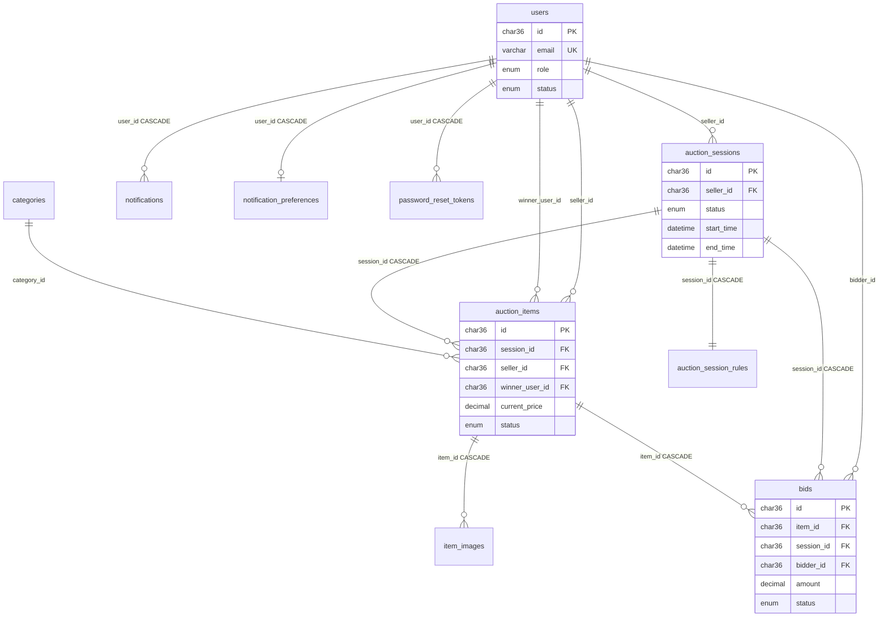

# Database Schema

This document describes the MySQL database schema as defined by SQLAlchemy models in `backend/app/models/` and Alembic migrations in `backend/alembic/versions/`.

**Database engine:** MySQL 8.0 (via `mysql+asyncmy` async driver)  
**UUID storage:** `CHAR(36)` through `UUIDString` (`backend/app/database/types.py`)  
**ORM base:** `Base` in `backend/app/database/base.py`

---

## Tables Overview

| # | Table | Model class | Domain |
|---|-------|-------------|--------|
| 1 | `users` | `User` | Users / auth |
| 2 | `categories` | `Category` | Categories |
| 3 | `auction_sessions` | `AuctionSession` | Auction sessions |
| 4 | `auction_session_rules` | `AuctionSessionRule` | Session rules |
| 5 | `auction_items` | `AuctionItem` | Auction items |
| 6 | `item_images` | `ItemImage` | Item images |
| 7 | `bids` | `Bid` | Bids |
| 8 | `notifications` | `Notification` | Notifications |
| 9 | `notification_preferences` | `NotificationPreference` | Notification prefs |
| 10 | `password_reset_tokens` | `PasswordResetToken` | Password reset |

### Tables NOT in codebase

The following tables appear in product/design docs but **do not exist** in models or migrations:

- `wallets`
- `wallet_transactions`
- `payments`

---

## Alembic Migration History

| Revision | File | Effect |
|----------|------|--------|
| `171bf3dda30e` | `create_auction_tables.py` | **Creates all tables** via `Base.metadata.create_all()` |
| `4518d1a038f1` | `add_phone_verified_to_users.py` | No-op (`pass`) — no `phone_verified` column in current models |
| `a3f8c2d91e04` | `convert_uuid_columns_to_char36.py` | No-op (`pass`) — UUIDs already `CHAR(36)` at creation |
| `b7e4f1a92c03` | `add_unique_category_name_constraint.py` | No-op (`pass`) — constraint already in model |
| `c8d2e5f03a14` | `make_item_images_image_url_nullable.py` | No-op (`pass`) — already nullable in model |

**Note:** `app/main.py` lifespan also calls `Base.metadata.create_all()` on startup (in addition to Alembic).

All models are registered for metadata via `import app.models` in `app/models/__init__.py`.

---

## 1. `users`

**Model:** `app/models/user_model.py` → `User`

### Columns

| Column | SQL type | Nullable | Default | Notes |
|--------|----------|----------|---------|-------|
| `id` | `CHAR(36)` | NO | `uuid4()` | Primary key |
| `email` | `VARCHAR(255)` | NO | — | Unique |
| `password_hash` | `VARCHAR(255)` | NO | — | |
| `full_name` | `VARCHAR(255)` | NO | `'user'` | |
| `phone` | `VARCHAR(30)` | NO | — | |
| `role` | `ENUM('ADMIN','USER')` | NO | `'USER'` | MySQL enum `user_role` |
| `status` | `ENUM('ACTIVE','BANNED')` | NO | `'ACTIVE'` | MySQL enum `user_status` |
| `created_at` | `DATETIME` | NO | `now()` | |
| `updated_at` | `DATETIME` | NO | `now()` | On update |

### Primary key

- `PRIMARY KEY (id)`

### Foreign keys

None (root entity).

### Unique constraints

- `email` — column-level `unique=True`

### Indexes

| Index | Columns |
|-------|---------|
| Primary | `id` |
| Unique | `email` |
| Implicit on unique | `email` (also `index=True`) |

### Relationships (ORM)

| Relationship | Target | FK column | Back-populates |
|--------------|--------|-----------|----------------|
| `auction_sessions` | `AuctionSession` | `AuctionSession.seller_id` | `seller` |
| `selling_items` | `AuctionItem` | `AuctionItem.seller_id` | `seller` |
| `won_items` | `AuctionItem` | `AuctionItem.winner_user_id` | `winner` |
| `bids` | `Bid` | `Bid.bidder_id` | `bidder` |

---

## 2. `categories`

**Model:** `app/models/category_model.py` → `Category`

### Columns

| Column | SQL type | Nullable | Default | Notes |
|--------|----------|----------|---------|-------|
| `id` | `CHAR(36)` | NO | `uuid4()` | PK |
| `name` | `VARCHAR(150)` | NO | — | |
| `slug` | `VARCHAR(150)` | NO | — | Unique |
| `status` | `ENUM('ACTIVE','INACTIVE')` | NO | `'ACTIVE'` | `category_status` |
| `created_at` | `DATETIME` | NO | `now()` | |

### Primary key

- `PRIMARY KEY (id)`

### Foreign keys

None.

### Unique constraints

- `uq_categories_name` — `UNIQUE (name)`
- `slug` — column-level unique

### Indexes

| Index | Columns |
|-------|---------|
| Primary | `id` |
| `ix_categories_status` | `status` |
| Unique | `slug` |

### Relationships

| Relationship | Target | Back-populates |
|--------------|--------|----------------|
| `auction_items` | `AuctionItem` | `category` |

---

## 3. `auction_sessions`

**Model:** `app/models/session_model.py` → `AuctionSession`

### Columns

| Column | SQL type | Nullable | Default | Notes |
|--------|----------|----------|---------|-------|
| `id` | `CHAR(36)` | NO | `uuid4()` | PK |
| `seller_id` | `CHAR(36)` | NO | — | FK → `users.id` |
| `title` | `VARCHAR(255)` | NO | — | |
| `description` | `TEXT` | YES | — | |
| `start_time` | `DATETIME` | NO | — | |
| `end_time` | `DATETIME` | NO | — | |
| `status` | `ENUM('SCHEDULED','ACTIVE','ENDED','CANCELLED')` | NO | `'SCHEDULED'` | `auction_session_status` |
| `created_at` | `DATETIME` | NO | `now()` | |
| `updated_at` | `DATETIME` | NO | `now()` | |

### Primary key

- `PRIMARY KEY (id)`

### Foreign keys

| Name | Column | References | ON DELETE |
|------|--------|------------|-----------|
| `fk_auction_sessions_seller` | `seller_id` | `users.id` | *(none / RESTRICT)* |

### Unique constraints

None beyond PK.

### Indexes

| Index | Columns |
|-------|---------|
| Primary | `id` |
| Index | `seller_id` |
| Index | `status` |

### Relationships

| Relationship | Target | Cascade (ORM) | Notes |
|--------------|--------|---------------|-------|
| `seller` | `User` | — | |
| `rules` | `AuctionSessionRule` | `all, delete-orphan` | 1:1, `passive_deletes=True` |
| `items` | `AuctionItem` | `all, delete-orphan` | `passive_deletes=True` |
| `bids` | `Bid` | — | |

---

## 4. `auction_session_rules`

**Model:** `app/models/auction_session_rule_model.py` → `AuctionSessionRule`

### Columns

| Column | SQL type | Nullable | Default | Notes |
|--------|----------|----------|---------|-------|
| `id` | `CHAR(36)` | NO | `uuid4()` | PK |
| `session_id` | `CHAR(36)` | NO | — | FK, **unique** (1:1) |
| `min_increment` | `DECIMAL(18,2)` | NO | `1.00` | |
| `created_at` | `DATETIME` | NO | `now()` | |
| `updated_at` | `DATETIME` | NO | `now()` | |

### Primary key

- `PRIMARY KEY (id)`

### Foreign keys

| Name | Column | References | ON DELETE |
|------|--------|------------|-----------|
| `fk_auction_session_rules_session` | `session_id` | `auction_sessions.id` | **CASCADE** |

### Unique constraints

- `session_id` — column-level `unique=True`

### Indexes

| Index | Columns |
|-------|---------|
| Primary | `id` |
| Unique | `session_id` |

### Relationships

| Relationship | Target | Back-populates |
|--------------|--------|----------------|
| `session` | `AuctionSession` | `rules` |

---

## 5. `auction_items`

**Model:** `app/models/item_model.py` → `AuctionItem`

### Columns

| Column | SQL type | Nullable | Default | Notes |
|--------|----------|----------|---------|-------|
| `id` | `CHAR(36)` | NO | `uuid4()` | PK |
| `seller_id` | `CHAR(36)` | NO | — | FK → `users.id` |
| `session_id` | `CHAR(36)` | NO | — | FK → `auction_sessions.id` |
| `category_id` | `CHAR(36)` | YES | — | FK → `categories.id` |
| `title` | `VARCHAR(255)` | NO | — | |
| `description` | `TEXT` | YES | — | |
| `starting_price` | `DECIMAL(18,2)` | NO | — | |
| `current_price` | `DECIMAL(18,2)` | NO | `0.00` | |
| `status` | `ENUM('SOLD','UNSOLD','CANCELLED')` | NO | `'UNSOLD'` | `auction_item_status` |
| `winner_user_id` | `CHAR(36)` | YES | — | FK → `users.id` |
| `final_price` | `DECIMAL(18,2)` | YES | — | Set on session end |
| `opened_at` | `DATETIME` | YES | — | Set when session starts |
| `closed_at` | `DATETIME` | YES | — | Set on finalization |
| `created_at` | `DATETIME` | NO | `now()` | |
| `updated_at` | `DATETIME` | NO | `now()` | |

### Primary key

- `PRIMARY KEY (id)`

### Foreign keys

| Name | Column | References | ON DELETE |
|------|--------|------------|-----------|
| `fk_auction_items_seller` | `seller_id` | `users.id` | *(none)* |
| `fk_auction_items_session` | `session_id` | `auction_sessions.id` | **CASCADE** |
| `fk_auction_items_category` | `category_id` | `categories.id` | *(none)* |
| `fk_auction_items_winner` | `winner_user_id` | `users.id` | *(none)* |

### Unique constraints

None beyond PK.

### Indexes

| Index | Columns |
|-------|---------|
| Primary | `id` |
| `ix_auction_items_session_status` | `(session_id, status)` — composite |
| Index | `seller_id` |
| Index | `session_id` |
| Index | `category_id` |
| Index | `status` |
| Index | `winner_user_id` |

### Relationships

| Relationship | Target | Cascade (ORM) |
|--------------|--------|---------------|
| `seller` | `User` | — |
| `winner` | `User` | — |
| `session` | `AuctionSession` | — |
| `category` | `Category` | — |
| `images` | `ItemImage` | `all, delete-orphan`, `passive_deletes=True` |
| `bids` | `Bid` | `all, delete-orphan` |

---

## 6. `item_images`

**Model:** `app/models/image_model.py` → `ItemImage`

### Columns

| Column | SQL type | Nullable | Default | Notes |
|--------|----------|----------|---------|-------|
| `id` | `CHAR(36)` | NO | `uuid4()` | PK |
| `item_id` | `CHAR(36)` | NO | — | FK → `auction_items.id` |
| `image_url` | `VARCHAR(500)` | YES | — | Nullable since model/migration |
| `is_primary` | `BOOLEAN` | NO | `false` | |
| `sort_order` | `INTEGER` | NO | `0` | |
| `created_at` | `DATETIME` | NO | `now()` | |

### Primary key

- `PRIMARY KEY (id)`

### Foreign keys

| Name | Column | References | ON DELETE |
|------|--------|------------|-----------|
| `fk_item_images_item` | `item_id` | `auction_items.id` | **CASCADE** |

### Unique constraints

- `uq_item_images_item_sort_order` — `UNIQUE (item_id, sort_order)`

### Indexes

| Index | Columns |
|-------|---------|
| Primary | `id` |
| Index | `item_id` |

### Relationships

| Relationship | Target | Back-populates |
|--------------|--------|----------------|
| `item` | `AuctionItem` | `images` |

---

## 7. `bids`

**Model:** `app/models/bid_model.py` → `Bid`

### Columns

| Column | SQL type | Nullable | Default | Notes |
|--------|----------|----------|---------|-------|
| `id` | `CHAR(36)` | NO | `uuid4()` | PK |
| `item_id` | `CHAR(36)` | NO | — | FK → `auction_items.id` |
| `session_id` | `CHAR(36)` | NO | — | FK → `auction_sessions.id` |
| `bidder_id` | `CHAR(36)` | NO | — | FK → `users.id` |
| `amount` | `DECIMAL(18,2)` | NO | — | |
| `status` | `ENUM('WINNING','OUTBID')` | NO | `'OUTBID'` | `bid_status` |
| `created_at` | `DATETIME` | NO | `now()` | |

### Primary key

- `PRIMARY KEY (id)`

### Foreign keys

| Name | Column | References | ON DELETE |
|------|--------|------------|-----------|
| `fk_bids_item` | `item_id` | `auction_items.id` | **CASCADE** |
| `fk_bids_session` | `session_id` | `auction_sessions.id` | **CASCADE** |
| `fk_bids_bidder` | `bidder_id` | `users.id` | *(none)* |

### Unique constraints

None (multiple bids per item/bidder allowed).

### Indexes

| Index | Columns |
|-------|---------|
| Primary | `id` |
| `ix_bids_item_created_at` | `(item_id, created_at)` — composite |
| `ix_bids_item_status` | `(item_id, status)` — composite |
| Index | `item_id` |
| Index | `session_id` |
| Index | `bidder_id` |
| Index | `status` |

### Relationships

| Relationship | Target | Back-populates |
|--------------|--------|----------------|
| `item` | `AuctionItem` | `bids` |
| `session` | `AuctionSession` | `bids` |
| `bidder` | `User` | `bids` |

---

## 8. `notifications`

**Model:** `app/models/notification_model.py` → `Notification`

### Columns

| Column | SQL type | Nullable | Default | Notes |
|--------|----------|----------|---------|-------|
| `id` | `CHAR(36)` | NO | `uuid4()` | PK |
| `user_id` | `CHAR(36)` | NO | — | FK → `users.id` |
| `type` | `ENUM('BID','AUCTION','SYSTEM')` | NO | — | `notification_type` |
| `title` | `VARCHAR(255)` | NO | — | |
| `message` | `TEXT` | NO | — | |
| `action_url` | `VARCHAR(500)` | YES | — | |
| `is_read` | `BOOLEAN` | NO | `false` | |
| `created_at` | `DATETIME` | NO | `now()` | |
| `updated_at` | `DATETIME` | NO | `now()` | |

### Primary key

- `PRIMARY KEY (id)`

### Foreign keys

| Column | References | ON DELETE |
|--------|------------|-----------|
| `user_id` | `users.id` | **CASCADE** |

*(No explicit constraint name in model.)*

### Unique constraints

None.

### Indexes

| Index | Columns |
|-------|---------|
| Primary | `id` |
| Index | `user_id` |

### Relationships

| Relationship | Target |
|--------------|--------|
| `user` | `User` |

---

## 9. `notification_preferences`

**Model:** `app/models/notification_preference_model.py` → `NotificationPreference`

### Columns

| Column | SQL type | Nullable | Default | Notes |
|--------|----------|----------|---------|-------|
| `id` | `CHAR(36)` | NO | `uuid4()` | PK |
| `user_id` | `CHAR(36)` | NO | — | FK, unique (1:1) |
| `notify_when_outbid` | `BOOLEAN` | NO | `true` | |
| `remind_before_auction_ends` | `BOOLEAN` | NO | `true` | *(not used in code yet)* |
| `receive_featured_auction_news` | `BOOLEAN` | NO | `true` | *(not used in code yet)* |
| `created_at` | `DATETIME` | NO | `now()` | |
| `updated_at` | `DATETIME` | NO | `now()` | |

### Primary key

- `PRIMARY KEY (id)`

### Foreign keys

| Column | References | ON DELETE |
|--------|------------|-----------|
| `user_id` | `users.id` | **CASCADE** |

### Unique constraints

- `user_id` — column-level `unique=True`

### Indexes

| Index | Columns |
|-------|---------|
| Primary | `id` |
| Unique + index | `user_id` |

---

## 10. `password_reset_tokens`

**Model:** `app/models/password_reset_token_model.py` → `PasswordResetToken`

### Columns

| Column | SQL type | Nullable | Default | Notes |
|--------|----------|----------|---------|-------|
| `id` | `CHAR(36)` | NO | `uuid4()` | PK |
| `user_id` | `CHAR(36)` | NO | — | FK → `users.id` |
| `token_hash` | `VARCHAR(64)` | NO | — | SHA-256 hash, unique |
| `expires_at` | `DATETIME` | NO | — | |
| `used_at` | `DATETIME` | YES | — | |
| `created_at` | `DATETIME` | NO | `now()` | |
| `updated_at` | `DATETIME` | NO | `now()` | |

### Primary key

- `PRIMARY KEY (id)`

### Foreign keys

| Column | References | ON DELETE |
|--------|------------|-----------|
| `user_id` | `users.id` | **CASCADE** |

### Unique constraints

- `token_hash` — unique

### Indexes

| Index | Columns |
|-------|---------|
| Primary | `id` |
| Index | `user_id` |
| Unique + index | `token_hash` |

---

## 8. Enum Values (MySQL ENUM columns)

Defined in `backend/common/enum.py`, used via `app/models/enums.py`:

| MySQL enum name | Python enum | Values |
|-----------------|-------------|--------|
| `user_role` | `UserRole` | `ADMIN`, `USER` |
| `user_status` | `UserStatus` | `ACTIVE`, `BANNED` |
| `category_status` | `CategoryStatus` | `ACTIVE`, `INACTIVE` |
| `auction_session_status` | `AuctionSessionStatus` | `SCHEDULED`, `ACTIVE`, `ENDED`, `CANCELLED` |
| `auction_item_status` | `AuctionItemStatus` | `SOLD`, `UNSOLD`, `CANCELLED` |
| `bid_status` | `BidStatus` | `WINNING`, `OUTBID` |
| `notification_type` | `NotificationType` | `BID`, `AUCTION`, `SYSTEM` |

**Application-only enum (not a DB column):** `MyBidOutcome` (`LEADING`, `OUTBID`, `WON`, `LOST`) — computed in `BidService._get_outcome()`.

---

## 9. Cascade Behavior Summary

### Database `ON DELETE CASCADE`

Deleting a parent row automatically deletes children:

```
users
  └── (no CASCADE from users to auction_sessions/items/bids — RESTRICT implied)

auction_sessions
  ├── auction_session_rules  (CASCADE)
  ├── auction_items          (CASCADE)
  └── bids                   (CASCADE via session_id)

auction_items
  ├── item_images            (CASCADE)
  └── bids                   (CASCADE via item_id)

users (when deleted)
  ├── notifications          (CASCADE)
  ├── notification_preferences (CASCADE)
  └── password_reset_tokens  (CASCADE)
```

### SQLAlchemy ORM cascade

| Parent | Child | ORM cascade | passive_deletes |
|--------|-------|-------------|-----------------|
| `AuctionSession` | `AuctionSessionRule` | `all, delete-orphan` | Yes |
| `AuctionSession` | `AuctionItem` | `all, delete-orphan` | Yes |
| `AuctionItem` | `ItemImage` | `all, delete-orphan` | Yes |
| `AuctionItem` | `Bid` | `all, delete-orphan` | No |

`passive_deletes=True` lets the database handle deletes via FK `ON DELETE CASCADE` without ORM issuing separate DELETE statements.

---

## 10. Domain Table Groupings

### Auction sessions

| Table | Role |
|-------|------|
| `auction_sessions` | Session lifecycle, schedule, seller |
| `auction_session_rules` | `min_increment` bidding rule |

### Auction items

| Table | Role |
|-------|------|
| `auction_items` | Product, pricing, status, winner |
| `categories` | Optional classification |
| `item_images` | Product images |

### Bids

| Table | Role |
|-------|------|
| `bids` | Bid history, WINNING/OUTBID status |
| `auction_items` | `current_price` updated on each bid |
| `auction_session_rules` | Minimum increment validation |

### Users

| Table | Role |
|-------|------|
| `users` | Accounts, roles, auth |
| `password_reset_tokens` | Forgot-password flow |

### Notifications

| Table | Role |
|-------|------|
| `notifications` | In-app notification records |
| `notification_preferences` | Per-user opt-in flags |

### Payments

**Not implemented.** No tables exist.

### Images

| Table | Role |
|-------|------|
| `item_images` | Metadata (`image_url`, `is_primary`, `sort_order`) |
| Files stored on disk at `uploads/` (not in DB) |

---

## 11. Current Transaction Handling

### Session factory

**File:** `backend/app/core/database.py`

```python
engine = create_async_engine(settings.database_url, echo=True, pool_pre_ping=True)

AsyncSessionLocal = async_sessionmaker(
    bind=engine,
    class_=AsyncSession,
    expire_on_commit=False,
    autoflush=False,
)
```

### Request-scoped session

`get_db()` yields one `AsyncSession` per HTTP/WebSocket request:

```python
async def get_db() -> AsyncGenerator[AsyncSession, None]:
    async with AsyncSessionLocal() as session:
        try:
            yield session
        finally:
            await session.close()
```

**Note:** `backend/app/core/database.py` does **not** auto-rollback on exception.  
`backend/app/core/session.py` (duplicate helper) **does** rollback on exception, but routers import from `database.py`.

### Commit pattern

Services use **explicit** transaction control:

| Pattern | Usage |
|---------|-------|
| `await db.commit()` | After successful writes in services |
| `await db.rollback()` | On `AppException` or unexpected errors |
| `await db.flush()` | Before refresh or within uncommitted work |
| No `@transactional` decorator | Each service method owns its boundary |

### Multi-step transactions

Examples where multiple tables commit together:

| Operation | Tables in one transaction |
|-----------|---------------------------|
| `create_session` | `auction_sessions` + `auction_session_rules` |
| `place_bid` | `bids` (insert + update) + `auction_items` + `notifications` |
| `approve_session` | `auction_sessions` + `auction_items` + `notifications` |
| `reject_session` / `cancel_session` | `auction_sessions` + `auction_items` + `notifications` |

### Lazy status sync commits

`AuctionSessionRepository.synchronize_time_based_statuses()` may run inside a read request and commit separately when `changed_count > 0` (called from session/item/bid list services).

### Realtime publish after commit

`BidService.place_bid()` commits first, then publishes WebSocket `BID_PLACED` — realtime failure does not roll back the bid.

---

## 12. Row Locking (`SELECT … FOR UPDATE`)

Only **two** repository methods use pessimistic row locking:

### 1. Bid placement — lock auction item

**File:** `modules/auction_items/item_repository.py`  
**Method:** `find_by_id_for_update()`  
**Caller:** `BidService.place_bid()`

```python
select(AuctionItem)
    .options(selectinload(AuctionItem.session).selectinload(AuctionSession.rules))
    .where(AuctionItem.id == item_id)
    .with_for_update()
```

**Locks:** The `auction_items` row for the duration of the bid transaction.

**Does NOT lock:**

- The previous winning `bids` row explicitly
- The `auction_sessions` row (loaded via join/selectinload, not locked)

### 2. Session mutations — lock auction session

**File:** `modules/auction_sessions/session_repository.py`  
**Method:** `find_by_id_for_update()`  
**Callers:** `AuctionSessionService.start_session()`, `approve_session()`, `reject_session()`, `cancel_session()`

```python
select(AuctionSession)
    .options(selectinload(AuctionSession.rules), selectinload(AuctionSession.items))
    .where(AuctionSession.id == session_id)
    .with_for_update()
```

**Locks:** The `auction_sessions` row and in-memory related items loaded into the session.

### No locking elsewhere

| Operation | Locking |
|-----------|---------|
| `find_winning_by_item_id()` | Plain `SELECT` |
| `synchronize_time_based_statuses()` | Bulk `UPDATE` without `FOR UPDATE` |
| `_finalize_ended_items()` | Plain `SELECT` + Python loop updates |
| Notification create/read | No locks |
| Image upload | No locks |

**MySQL default:** `with_for_update()` uses `FOR UPDATE` (exclusive row lock under InnoDB).

---

## 13. Concurrent Update Scenarios

### A. Two bidders on the same item (handled)

```
Bidder A ──POST /bids──► find_by_id_for_update(item) ──LOCK──► commit
Bidder B ──POST /bids──► find_by_id_for_update(item) ──WAIT──► ...
```

The item row lock serializes concurrent `place_bid()` calls for the same `item_id`. The second bidder reads updated `current_price` and winning bid after the first commits.

**Within one bid transaction:**

1. Lock `auction_items` row
2. Read winning bid (plain select)
3. Set old bid → `OUTBID`
4. Insert new bid → `WINNING`
5. Update `auction_items.current_price`
6. Commit

### B. Bid vs session end / finalization (race — not fully locked)

`synchronize_time_based_statuses()` runs bulk updates **without** row locks:

- Sets `auction_sessions.status → ENDED`
- `_finalize_ended_items()` sets `auction_items.status`, `winner_user_id`, `final_price`

This can run concurrently with `place_bid()` on the same item because:

- Finalization does not use `FOR UPDATE`
- A bid could commit while a parallel read triggers session ENDED
- `place_bid` checks `session.status == ACTIVE` before commit, but status may change between check and commit if sync runs in another request

**Risk:** Bid accepted near `end_time` while another request ends the session; or finalize overwrites item while bid in flight (mitigated partially by item row lock during bid).

### C. Multiple requests triggering status sync (race)

Any concurrent GET (list sessions, list items, get detail, list my bids) may call `synchronize_time_based_statuses()` and commit. Multiple workers can run the same bulk UPDATEs concurrently.

**Risk:** Duplicate finalization attempts (mostly idempotent: setting ENDED twice, re-finalizing UNSOLD items).

### D. Session start vs auto-sync (race)

`start_session()` locks session row (`FOR UPDATE`), but `synchronize_time_based_statuses()` can auto-activate SCHEDULED sessions without locking the same row first.

**Risk:** Double activation paths (manual start vs time-based sync) on overlapping requests.

### E. Winning bid integrity (partial)

There is **no unique constraint** enforcing at most one `WINNING` bid per item. Correctness relies on:

- Item row lock during `place_bid`
- Application logic setting previous winner to `OUTBID`

A bug or bypass of `place_bid` could leave multiple `WINNING` bids. `_finalize_ended_items` picks one by `ORDER BY amount DESC, created_at ASC LIMIT 1`.

### F. Notifications (low contention)

`notify_outbid` inserts a notification in the same transaction as the bid. No locking on `notification_preferences`; stale read of preference flag is acceptable.

### G. Image upload (no locking)

Concurrent uploads to the same item could race on `sort_order` / primary flag without row lock on `auction_items` (only session SCHEDULED check).

---

## 14. Text-Based Relationship Diagram

```
                                    ┌─────────────────────┐
                                    │       users         │
                                    ├─────────────────────┤
                                    │ PK id               │
                                    │    email (UNIQUE)   │
                                    │    password_hash    │
                                    │    full_name        │
                                    │    phone            │
                                    │    role (ENUM)      │
                                    │    status (ENUM)    │
                                    │    created_at       │
                                    │    updated_at       │
                                    └─────────┬───────────┘
                                              │
           ┌──────────────────────────────────┼──────────────────────────────────┐
           │                                  │                                  │
           │ seller_id                        │ seller_id                        │ bidder_id
           │                                  │ winner_user_id                   │
           ▼                                  ▼                                  │
┌──────────────────────┐              ┌──────────────────────┐                   │
│  auction_sessions    │              │    auction_items     │◄──────────────────┤
├──────────────────────┤              ├──────────────────────┤                   │
│ PK id                │──session_id──│ PK id                │                   │
│ FK seller_id ────────┼──────────────│ FK seller_id         │                   │
│    title             │   CASCADE    │ FK session_id        │                   │
│    description       │              │ FK category_id ──────┼──┐                │
│    start_time        │              │ FK winner_user_id ───┼──┼──► users       │
│    end_time          │              │    title             │  │                │
│    status (ENUM)     │              │    starting_price    │  │                │
│    created_at        │              │    current_price     │  │                │
│    updated_at        │              │    status (ENUM)     │  │                │
└──────────┬───────────┘              │    final_price       │  │                │
           │                          │    opened_at         │  │                │
           │ 1:1                      │    closed_at         │  │                │
           ▼                          │    created_at        │  │                │
┌──────────────────────┐              │    updated_at        │  │                │
│auction_session_rules │              └──────────┬───────────┘  │                │
├──────────────────────┤                         │              │                │
│ PK id                │                         │              │                │
│ FK session_id (UQ)   │                         │ 1:N          │                │
│    min_increment     │                         ▼              ▼                │
│    created_at        │              ┌──────────────────┐  ┌─────────────┐       │
│    updated_at        │              │   item_images    │  │ categories  │       │
└──────────────────────┘              ├──────────────────┤  ├─────────────┤       │
                                      │ PK id            │  │ PK id       │       │
                                      │ FK item_id       │  │    name(UQ) │       │
           session_id                 │    image_url     │  │    slug(UQ) │       │
           ┌──────────────────────────│    is_primary    │  │    status   │       │
           │                          │    sort_order    │  │ created_at  │       │
           │                          │    created_at    │  └─────────────┘       │
           │                          └──────────────────┘                        │
           │                                                                      │
           │                          ┌──────────────────┐                        │
           └──────────────────────────│      bids        │◄───────────────────────┘
                                      ├──────────────────┤      item_id (CASCADE)
                                      │ PK id            │      bidder_id
                                      │ FK item_id       │
                                      │ FK session_id      │
                                      │ FK bidder_id ──────┼──────────► users
                                      │    amount          │
                                      │    status (ENUM)   │
                                      │    created_at      │
                                      └──────────────────┘

┌─────────────────────┐     ┌───────────────────────────┐     ┌─────────────────────────┐
│   notifications     │     │ notification_preferences  │     │ password_reset_tokens   │
├─────────────────────┤     ├───────────────────────────┤     ├─────────────────────────┤
│ PK id               │     │ PK id                     │     │ PK id                   │
│ FK user_id ─────────┼──►  │ FK user_id (UQ) ──────────┼──►  │ FK user_id ─────────────┼──► users
│    type (ENUM)      │     │    notify_when_outbid     │     │    token_hash (UQ)      │
│    title            │     │    remind_before_...      │     │    expires_at           │
│    message          │     │    receive_featured_...   │     │    used_at              │
│    action_url       │     │    created_at             │     │    created_at           │
│    is_read          │     │    updated_at             │     │    updated_at           │
│    created_at       │     └───────────────────────────┘     └─────────────────────────┘
│    updated_at       │
└─────────────────────┘
         ON DELETE CASCADE from users

┌─────────────────────────────────────────────────────────────────┐
│  NOT IN DATABASE (design docs only)                             │
│  wallets │ wallet_transactions │ payments                       │
└─────────────────────────────────────────────────────────────────┘
```

### Mermaid ER diagram (equivalent)



---

## 15. Bid Concurrency Design Notes

The bidding hot path in `BidService.place_bid()`:

1. **`find_by_id_for_update(item_id)`** — acquires InnoDB row lock on `auction_items`
2. Validates item `UNSOLD`, session `ACTIVE`, amount ≥ minimum
3. Updates prior `WINNING` bid → `OUTBID` (same transaction)
4. Inserts new `WINNING` bid
5. Updates `auction_items.current_price`
6. **`commit()`** — releases lock
7. Publishes WebSocket event (post-commit)

**Gap:** Session lifecycle updates (`synchronize_time_based_statuses`, `_finalize_ended_items`) do not coordinate with item row locks. For production hardening, consider:

- Locking session row during finalization
- Dedicated scheduler instead of lazy sync on reads
- DB constraint or trigger ensuring one `WINNING` bid per item
- Re-check session/item status immediately before commit inside the locked transaction

---

*Generated from SQLAlchemy models and Alembic migrations in the Live-Auction backend.*
